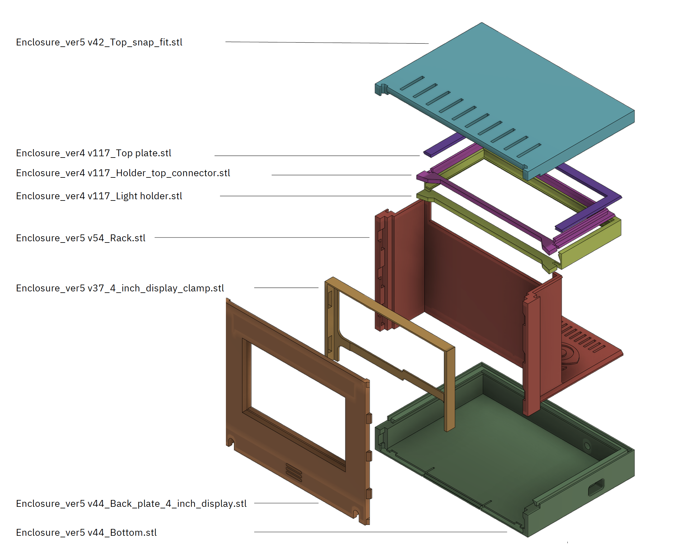

# RasQberry_enclosure
Enclosure for the RasQberry project. Replicates the look of the IBM Q System One.

### STL files for Version 5
This is a mapping of the STL files necessary for printig all parts for version 5: (a short assembly animation for version 5 of the RasQberry 3D model can be found [here](https://www.youtube.com/watch?v=kTnV4gf6yoc&feature=youtu.be)) 

