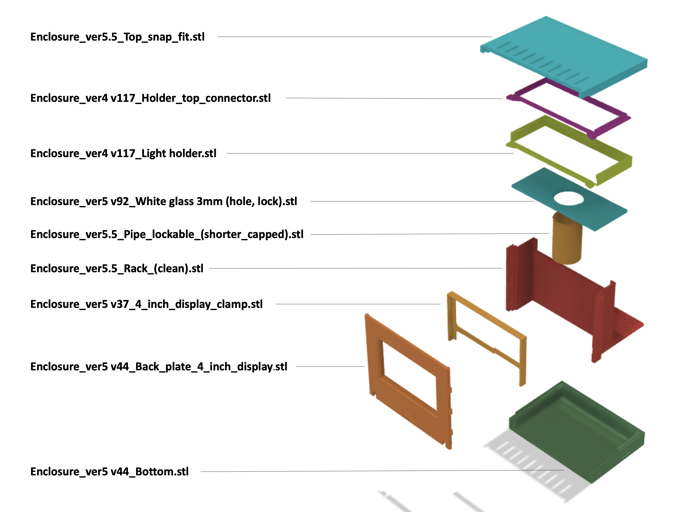

# RasQberry_enclosure
Enclosure for the RasQberry project. Replicates the look of the IBM Q System One.

### STL files for Version 5.5
This is a mapping of the STL files necessary for printig all parts for version 5: 

### Assembly for Version 5.5
 

